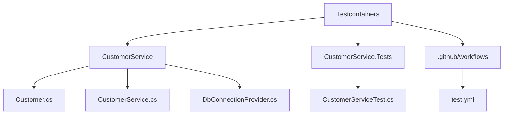

Testcontainers Demo (.NET + PostgreSQL) 

https://dotnet.testcontainers.org/

This project demonstrates using Testcontainers for .NET to run integration tests with a PostgreSQL container.

🗂️ **Project Structure**

Tech Stack: .NET 9, xUnit, Testcontainers, PostgreSQL (Docker), GitHub Actions

Running Tests Locally:
1. Make sure Docker is running
2. Execute "dotnet test"

CI/CD: Tests run on every push and PR via GitHub Actions.

